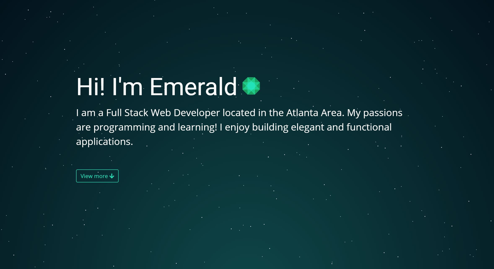
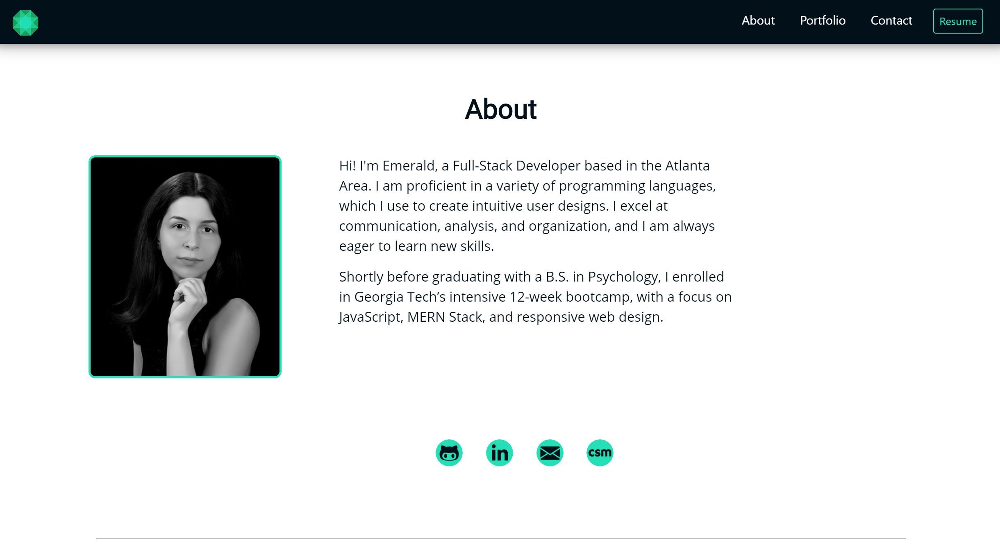

# Emerald Sea Hamel-Iervolino Portfolio 💎 A Node, Express, React App

Hi! I'm Emerald, a Full-Stack Developer based in the Atlanta Area. I am proficient in a variety of programming languages, which I use to create intuitive user designs. I excel at communication, analysis, and organization, and I am always eager to learn new skills.

Shortly before graduating with a B.S. in Psychology, I enrolled in Georgia Tech’s intensive 12-week bootcamp, with a focus on JavaScript, MERN Stack, and responsive web design.

# Deployed Application

Try it out!
[Emerald's Porfolio](https://www.emerald-sea.dev/)

# Technologies Used:
- Express
- Heroku
- HTML & CSS
- JavaScript
- jQuery
- Node.js
- NPM:
  - @brainhubeu/react-carousel
  - animate.css
  - concurrently
  - express
  - nodemon
  - react-tooltip
- React

# Preview

>

>